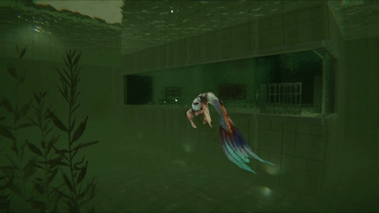
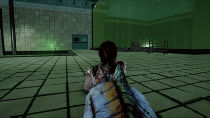
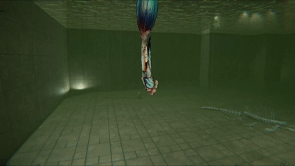

## Check out the game on Itch!
<iframe frameborder="0" src="https://itch.io/embed/4796003?linkback=true&amp;bg_color=000000&amp;fg_color=C5C6C5&amp;link_color=cd0606&amp;border_color=C5C6C5" width="552" height="167"><a href="https://aomame.itch.io/mermade">Mermade by Sonni, Nana, Yeupha, tabsco, Paulini, Eva Bagus</a></iframe>

## Overview

Mermade is an indie game that we developed the demo for in 1 semester, as a team of 6.
My role in the project was **sole programmer**.



## My Contribution

I was mainly responsible for:

- Character controller

- Procedural hand and tail movement

- Enemy AI

